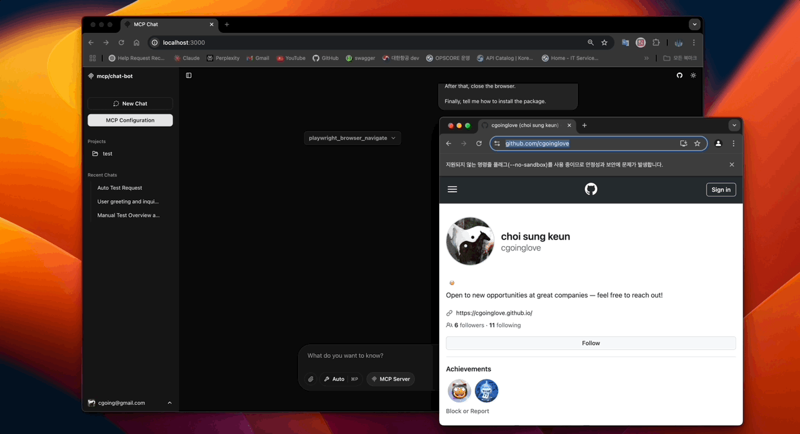

# MCP Client Chatbot (روبوت الدردشة العميل لـ MCP)

**English** | [한국어](./docs/ko.md) | **العربية**

[](#)
[](https://modelcontextprotocol.io/introduction)

**MCP Client Chatbot** هو واجهة دردشة متعددة الاستخدامات تدعم مختلف موفري نماذج الذكاء الاصطناعي مثل [OpenAI](https://openai.com/)، [Anthropic](https://www.anthropic.com/)، [Google](https://ai.google.dev/)، و [Ollama](https://ollama.com/). **إنه مصمم للتنفيذ الفوري في بيئات محلية 100% دون الحاجة إلى تكوين معقد**، مما يمكّن المستخدمين من التحكم الكامل في موارد الحوسبة على أجهزة الكمبيوتر الشخصية أو الخوادم الخاصة بهم.

> تم بناؤه باستخدام [Vercel AI SDK](https://sdk.vercel.ai) و [Next.js](https://nextjs.org/)، يعتمد هذا التطبيق أنماطًا حديثة لبناء واجهات دردشة الذكاء الاصطناعي. استفد من قوة [بروتوكول سياق النموذج (MCP)](https://modelcontextprotocol.io/introduction) لدمج الأدوات الخارجية بسلاسة في تجربة الدردشة الخاصة بك.

**🌟 مشروع مفتوح المصدر**
MCP Client Chatbot هو مشروع مفتوح المصدر بنسبة 100% يقوده المجتمع.

## جدول المحتويات

- [MCP Client Chatbot (روبوت الدردشة العميل لـ MCP)](#mcp-client-chatbot-روبوت-الدردشة-العميل-لـ-mcp)
  - [جدول المحتويات](#جدول-المحتويات)
  - [العرض التوضيحي](#العرض-التوضيحي)
    - [🧩 أتمتة المتصفح باستخدام Playwright MCP](#-أتمتة-المتصفح-باستخدام-playwright-mcp)
    - [⚡️ إشارات سريعة للأداة (`@`)](#️-إشارات-سريعة-للأداة--)
    - [🔌 إضافة خوادم MCP بسهولة](#-إضافة-خوادم-mcp-بسهولة)
    - [🛠️ اختبار الأدوات بشكل مستقل](#️-اختبار-الأدوات-بشكل-مستقل)
    - [📊 أدوات الرسوم البيانية المدمجة](#-أدوات-الرسوم-البيانية-المدمجة)
  - [✨ الميزات الرئيسية](#-الميزات-الرئيسية)
  - [🚀 البدء](#-البدء)
    - [متغيرات البيئة](#متغيرات-البيئة)
    - [إعداد خادم MCP](#إعداد-خادم-mcp)
  - [💡 نصائح وإرشادات](#-نصائح-وإرشادات)
  - [🗺️ خارطة الطريق: الميزات التالية](#️-خارطة-الطريق-الميزات-التالية)
    - [🚀 النشر والاستضافة](#-النشر-والاستضافة)
    - [🗣️ الصوت والدردشة في الوقت الفعلي](#️-الصوت-والدردشة-في-الوقت-الفعلي)
    - [📎 الملفات والصور](#-الملفات-والصور)
    - [🔄 سير عمل MCP](#-سير-عمل-mcp)
    - [🛠️ الأدوات المدمجة وتجربة المستخدم](#️-الأدوات-المدمجة-وتجربة-المستخدم)
    - [💻 كتابة كود LLM (مع Daytona)](#-كتابة-كود-llm-مع-daytona)
  - [🙌 المساهمة](#-المساهمة)

---

## العرض التوضيحي

فيما يلي بعض الأمثلة السريعة لكيفية استخدام MCP Client Chatbot:

---

### 🧩 أتمتة المتصفح باستخدام Playwright MCP




**مثال:** التحكم في متصفح الويب باستخدام أداة [playwright-mcp](https://github.com/microsoft/playwright-mcp) من Microsoft.

موجه نموذجي:

```prompt
الرجاء الانتقال إلى GitHub وزيارة ملف تعريف cgoinglove.
افتح مشروع mcp-client-chatbot.
ثم انقر فوق ملف README.md.
بعد ذلك، أغلق المتصفح.
أخيرًا، أخبرني بكيفية تثبيت الحزمة.
```
---


### ⚡️ إشارات سريعة للأداة (`@`)


استدعِ بسرعة أي أداة MCP مسجلة أثناء الدردشة عن طريق كتابة `@toolname`.
لا حاجة للحفظ - فقط اكتب `@` واختر من القائمة!

يمكنك أيضًا التحكم في كيفية استخدام الأدوات باستخدام **وضع اختيار الأداة** الجديد:
- **تلقائي:** يتم استدعاء الأدوات تلقائيًا بواسطة النموذج عند الحاجة.
- **يدوي:** سيطلب منك النموذج الإذن قبل استدعاء أي أداة.
- **لا شيء:** يعطل استخدام جميع الأدوات.

قم بتبديل الأوضاع في أي وقت باستخدام الاختصار `⌘P`.

---

### 🔌 إضافة خوادم MCP بسهولة


أضف خوادم MCP جديدة بسهولة من خلال واجهة المستخدم، وابدأ في استخدام أدوات جديدة دون إعادة تشغيل التطبيق.

---

### 🛠️ اختبار الأدوات بشكل مستقل


اختبر أدوات MCP بشكل مستقل عن جلسات الدردشة لتسهيل التطوير وتصحيح الأخطاء.

### 📊 أدوات الرسوم البيانية المدمجة


تصور استجابات روبوت الدردشة كمخططات دائرية أو شريطية أو خطية باستخدام الأداة المدمجة - مثالية للحصول على رؤى سريعة للبيانات أثناء المحادثات.

---


## ✨ الميزات الرئيسية

* **💻 تنفيذ محلي 100%:** قم بالتشغيل مباشرة على جهاز الكمبيوتر الشخصي أو الخادم الخاص بك دون الحاجة إلى نشر معقد، مع الاستفادة الكاملة من موارد الحوسبة والتحكم فيها.
* **🤖 دعم نماذج ذكاء اصطناعي متعددة:** قم بالتبديل بمرونة بين الموفرين مثل OpenAI و Anthropic و Google AI و Ollama.
* **🛠️ تكامل MCP قوي:** قم بتوصيل الأدوات الخارجية بسلاسة (أتمتة المتصفح، عمليات قاعدة البيانات، إلخ) في الدردشة عبر بروتوكول سياق النموذج.
* **🚀 اختبار أدوات مستقل:** اختبر وصحح أدوات MCP بشكل منفصل عن واجهة الدردشة الرئيسية.
* **💬 إشارات بديهية + التحكم في الأدوات:** قم بتشغيل الأدوات باستخدام `@`، وتحكم في وقت استخدامها عبر أوضاع `تلقائي` / `يدوي` / `لا شيء`.
* **⚙️ إعداد خادم سهل:** قم بتكوين اتصالات MCP عبر واجهة المستخدم أو ملف `.mcp-config.json`.
* **📄 واجهة مستخدم Markdown:** تواصل في واجهة مستخدم نظيفة وقابلة للقراءة تعتمد على Markdown.
* **💾 قاعدة بيانات محلية بدون إعداد:** يستخدم SQLite افتراضيًا للتخزين المحلي (يدعم PostgreSQL أيضًا).
* **🧩 دعم خادم MCP مخصص:** قم بتعديل منطق خادم MCP المدمج أو قم بإنشاء منطق خاص بك.
* **📊 أدوات الرسوم البيانية المدمجة:** قم بإنشاء مخططات دائرية وشريطية وخطية مباشرة في الدردشة باستخدام مطالبات طبيعية.


## 🚀 البدء

يستخدم هذا المشروع [pnpm](https://pnpm.io/) كمدير حزم موصى به.

```bash
# 1. تثبيت التبعيات
pnpm i

# 2. تهيئة المشروع (ينشئ .env، يعد قاعدة البيانات)
pnpm initial

# 3. بدء خادم التطوير
pnpm dev

# 4. (اختياري) بناء وبدء للاختبار المحلي
pnpm build:local && pnpm start
# استخدم build:local للبدء المحلي لضمان إعدادات ملفات تعريف الارتباط الصحيحة
```

افتح [http://localhost:3000](http://localhost:3000) في متصفحك للبدء.

-----


### متغيرات البيئة

يقوم الأمر `pnpm initial` بإنشاء ملف `.env`. أضف مفاتيح API الخاصة بك هناك:

```dotenv
GOOGLE_GENERATIVE_AI_API_KEY=****
OPENAI_API_KEY=****
# ANTHROPIC_API_KEY=****
```

SQLite هي قاعدة البيانات الافتراضية (`db.sqlite`). لاستخدام PostgreSQL، قم بتعيين `USE_FILE_SYSTEM_DB=false` وحدد `POSTGRES_URL` في `.env`.

-----

### إعداد خادم MCP

يمكنك توصيل أدوات MCP عبر:

1. **إعداد واجهة المستخدم:** انتقل إلى http://localhost:3000/mcp وقم بالتكوين من خلال الواجهة.
2. **تحرير الملف المباشر:** قم بتعديل `.mcp-config.json` في جذر المشروع.
3. **منطق مخصص:** قم بتحرير `./custom-mcp-server/index.ts` لتنفيذ المنطق الخاص بك.

-----

## 💡 نصائح وإرشادات
فيما يلي بعض النصائح والإرشادات العملية لاستخدام MCP Client Chatbot:

* [ميزة المشروع مع خادم MCP](./docs/tips-guides/project_with_mcp.md): تعلم كيفية دمج تعليمات وهياكل النظام مع خوادم MCP لبناء وكيل يساعد في إدارة المشاريع المستندة إلى GitHub.

* [دليل استضافة Docker](#): قريبا...

-----

## 🗺️ خارطة الطريق: الميزات التالية

يتطور MCP Client Chatbot مع هذه الميزات القادمة:

### 🚀 النشر والاستضافة
- **الاستضافة الذاتية:**
  - نشر سهل باستخدام Docker Compose
  - دعم نشر Vercel (خادم MCP: SSE فقط)

### 🗣️ الصوت والدردشة في الوقت الفعلي
- **فتح الدردشة الصوتية في الوقت الفعلي:**
  - دردشة صوتية في الوقت الفعلي مع تكامل خادم MCP

### 📎 الملفات والصور
- **إرفاق الملفات وإنشاء الصور:**
  - تحميل الملفات وإنشاء الصور
  - دعم المحادثات متعددة الوسائط

### 🔄 سير عمل MCP
- **تدفق MCP:**
  - أتمتة سير العمل مع تكامل خادم MCP

### 🛠️ الأدوات المدمجة وتجربة المستخدم
- **الأدوات الافتراضية لروبوت الدردشة:**
  - تحرير المستندات التعاوني (مثل OpenAI Canvas: تحرير مشترك بين المستخدم والمساعد)
  - RAG (الجيل المعزز بالاسترجاع)
  - أدوات مدمجة مفيدة لتجربة مستخدم روبوت الدردشة (يمكن استخدامها بدون MCP)

### 💻 كتابة كود LLM (مع Daytona)
- **كتابة وتحرير الكود المدعوم بـ LLM باستخدام تكامل Daytona**
  - كتابة وتحرير وتنفيذ الكود المدعوم بـ LLM بسلاسة في بيئة تطوير سحابية عبر تكامل Daytona. قم بإنشاء وتعديل وتشغيل الكود على الفور بمساعدة الذكاء الاصطناعي - لا يلزم إعداد محلي.


💡 إذا كانت لديك اقتراحات أو تحتاج إلى ميزات محددة، فيرجى إنشاء [مشكلة](https://github.com/cgoinglove/mcp-client-chatbot/issues)!


-----

## 🙌 المساهمة

نرحب بجميع المساهمات! تقارير الأخطاء، أفكار الميزات، تحسينات الكود - كل شيء يساعدنا في بناء أفضل مساعد ذكاء اصطناعي محلي.

دعنا نبنيه معًا 🚀
